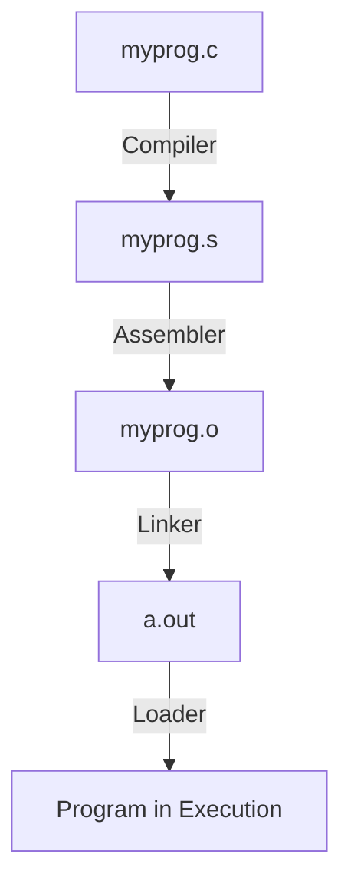
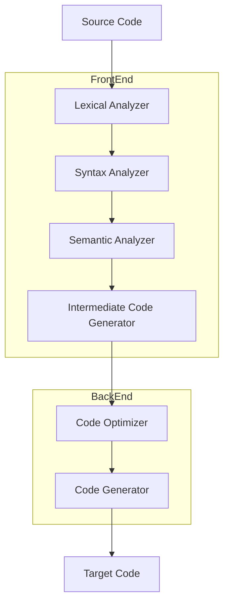

# Overview of Compiler

## Steps for Generating an Excutable Program



## The Structure of a Compiler



# Lexical Analysis

## Definitions

- A **token** is a pair of a token name and an optional attribute value.
- A **pattern** is a description of the form that the lexemes of a token may take. (Regular Expression)
- A **lexeme** is a sequence of characters in the source program that matches the pattern for a token.


## The Chomsky Hierarachy

- Unrestricted languages
    - Turing machines
- Context-sensitive languages
    - Linear bounded automata
- Context-free languages
    - Pushdown automata
- Regular languages
    - Finite automata

## Transition Diagram

- Implementation of Lexical Analysis

## Finite State Automata

- $A = (S, \Sigma, s_0, F, T)$
    - DFA: $T: S \times \Sigma \to S$
    - NFA: $T: S \times \Sigma \cup \{\epsilon\} \to S$

## Simulating a DFA

```c
s = s0;
c = nextChar();
while (c != eof) {
    s = move(s, c);
    c = nextChar();
}
if (s is in F) return "yes";
else return "no";
```

## Simulating an NFA

- Backtrack
- Parallelism
- look-ahead

```c
S = ϵ-closure(s0);
c = nextChar();
while (c != eof) {
    S = ϵ-closure(move(S, c));
    c = nextChar();
}
if (S ∩ F != ∅) return "yes";
else return "no";
```

## DFA & NFA

- 兩者可以互相轉換。
    1.  DFA 轉 NFA：DFA 本身屬於 NFA。
    2. NFA 轉 DFA：將狀態集合視為狀態。

## Regular Expressions to NFA

- Thompson's Construction
    - At most twice as many as operators and operands in regular expression
    - One start state, one accepting state
    - either one outgoing transition or tow outgoing transitions, both on $\epsilon$

## NFA to DFA

- Subset Construction

```c
add ϵ-closure(s0) as an unmarked state to Dstates;
while (there is an unmarked state T in Dstates) {
    mark T;
    for (each input symbol a) {
        U = ϵ-closure(move(T, a));
        if (U is not in Dstates) {
            add U as an unmarked state to Dstates;
            mark as final if U contains the original final state;
        }
        Dtranp[T, a] = U;
    }
}
```    

## DFA Minimization

- Divide the states into two groups:
    - final states
    - non-final states
- Division within a group $G$
    - If for every input symbol $a$, tow states $s$ and $t$ in $G$ have transitions on $a$ to the same group, then $s$ and $t$ stay in the same group.
    - Otherwise, divide $G$ and put $s$ and $t$ to different groups.
- Repeat the division, until no changes on grouping.

## Ambiguity Resolution

- Longest match
- First match
- Lookahead
